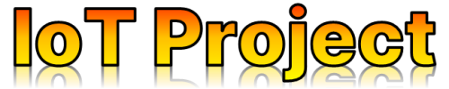

**Contributors:**

[simonfrayer]( https://github.com/simonfrayer ), [Agarud9](https://github.com/Agarud9), [kovacsand]( https://github.com/kovacsand ), [cullenNZ](https://github.com/JcullenNZ)

**Project Overview**

Welcome to our IoT Semester Project, a collaborative effort by a multidisciplinary team of 12 individuals organized into three specialized groups: IoT, Front-End, and Back-End/Cloud. Our goal was to design and implement a comprehensive IoT system capable of collecting, storing, and displaying environmental data from sensors. This README focuses on the IoT component of the project.

**Project Scope**

Device Specifications
Our IoT component is centered around an Arduino board equipped with sensors for Humidity, Temperature, and CO2. The Arduino facilitates data collection, processing, and transmission to the backend.

**Data Flow:**

Sensor data is collected by the IoT device.
The collected data is transmitted to the backend.
Backend stores the data in a database for future retrieval.
Front-End queries the backend to display the data on a web interface.

**Technologies Used:**

Programming Language: C
IoT Board: Arduino
Network Setup: Local network configuration

**Agile Methodology:**

We adopted the Scrum framework for agile development, ensuring iterative progress, flexibility, and effective communication within our team.

**Testing:**

Code quality and functionality were rigorously tested using the FFF library for C, ensuring robust and reliable performance.

**Acknowledgments**

We extend our gratitude to all team members who contributed to this project, ensuring its success through dedication, expertise, and effective collaboration.

Thank you for exploring our IoT Semester Project!

The very best IoT team
